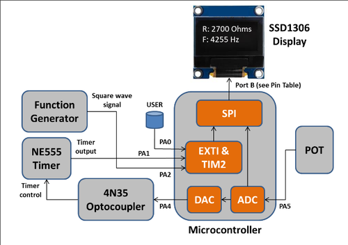

# Embedded System for PWM Control and Frequency Measurement

## Overview

The goal of this project was to design and implement an embedded system capable of controlling and
monitoring a pulse-width modulation (PWM) signal generated by a 555 timer (NE555 Integrated
Circuit). This system utilized an optocoupler (4N35 IC), controlled by the STM32F0 Discovery board’s
microcontroller, to manage both the frequency and duty cycle of the PWM signal.
The microcontroller interfaced with a potentiometer (POT) to adjust the PWM frequency and also
measure the frequency of a signal generated either by a 555 timer or a function generator. A push
button on the STM32F0 Discovery board toggled between the two signal sources. The measured
frequency, alongside the corresponding potentiometer resistance, was displayed on an LED display
(SSD1306 IC).

The main code for the project is located in `src/main.c`.

## System Components

- **STM32F0 Discovery Board (STM32F051R8T6)**: Manages the PWM control, signal measurement, and display updates.
- **555 Timer (NE555)**: Generates a PWM signal with adjustable frequency and duty cycle, controlled by a potentiometer.
- **Optocoupler (4N35)**: Provides electrical isolation between the microcontroller and the 555 timer.
- **Potentiometer**: Adjusts the frequency of the 555 timer's PWM signal.
- **Waveform Generator**: Provides an alternate frequency source for measurement.
- **SSD1306 LED Display**: Displays the measured signal frequency and potentiometer resistance in real time.

## How It Works

The system’s functionality is divided into key stages, each targeting a specific task for handling the PWM signal, measuring frequency, and updating the display.

#### 1. **ADC and DAC Configuration**  
   - The **ADC** was configured to read the analog voltage from the potentiometer connected to pin PA5. The ADC was initialized in single conversion mode, with the appropriate channel configured to convert the input voltage to a 12-bit digital value.
   - The software then processed the relayed the digital value obtained from ADC to the **DAC**, and calculated the potentiometer's resistance in ohms. This value was derived based on the known relationship between voltage and resistance for the circuit setup.

#### 2. **Frequency Measurement Using Timer Input Capture**  
   - A timer input capture **(TIM2)** was set up to measure the frequency of incoming signals. The timer was configured in input capture mode on a specified channel to record the rising edges of the signal.
   - The software used an interrupt-driven approach, where the capture/compare interrupt was triggered on each rising edge. The time interval between consecutive rising edges was stored and used to calculate the signal frequency.
   - This process was repeated for two input signal sources: the 555 timer and the function generator. Separate input configurations allowed for seamless switching between the sources while maintaining accurate frequency readings.

#### 3. **Dynamic Signal Source Switching**  
   - The **USER button** on PA0 was configured as an external interrupt source. Pressing the button triggered an interrupt service routine (ISR) that toggled the active signal source.
   - This switch dynamically updated the input signal for frequency measurement, enabling the user to select either the function generator or the 555 timer as the input source.

#### 4. **LED Display and SPI Communication**  
   - The **SSD1306 LED display** was connected using SPI communication. The SPI peripheral wasinitialized with the correct baud rate, polarity, and phase settings to communicate with the display module.
   - The display showed the measured signal frequency and the calculated resistance of the potentiometer. To enhance readability, the frequency and resistance were formatted as strings and displayed in distinct areas on the screen. 
   - Refreshing the display involved clearing the previous content and writing the updated values, ensuring accurate real-time monitoring of both parameters.

## System Limitations

During testing, we observed measurement errors, particularly at the higher end of the frequency spectrum. These errors were more pronounced when working with high-frequency signals.

### Cause of Errors
The primary cause of these errors was the interrupt and function call overhead in the software. The system relies on interrupts to capture and process input signals. However, the time spent handling each interrupt introduces a small delay. 

At higher frequencies, this delay becomes more noticeable and leads to increased measurement errors.

### Frequency Accuracy
- The software remained accurate for frequencies below **100 Hz**.
- Measurement errors were **±3 Hz** at **500 Hz** and up to **±9 Hz** at **1 MHz**.

### Potential Mitigation
To reduce these errors, a more advanced frequency detection algorithm could be implemented, such as:
- Averaging the frequency over several rising and falling edges.

However, implementing this solution goes beyond the scope of the current project.

## Demonstration

**Waveform Generator as Frequency Input:**  
Observe how the frequency remains constant as the resistance changes.

  

**Switching to 555 Timer as Frequency Input:**  
The resistance influences the frequency of the timer within its threshold range (800-1300Hz).

  

